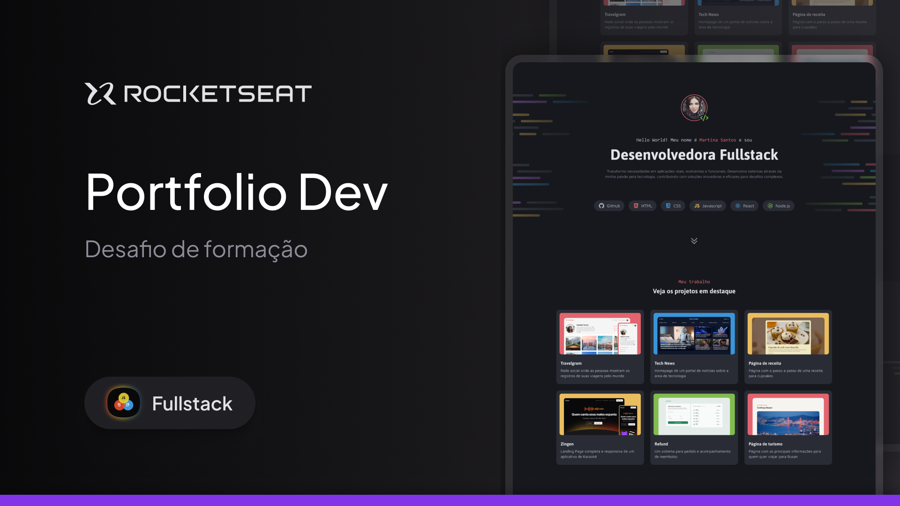

  

o projeto Portfolio Dev é um site desktop de portfólio para desenvolvedores, com links para projetos e contato do profissional.

  <a href="#-tecnologias">Tecnologias</a>&nbsp;&nbsp;&nbsp;|&nbsp;&nbsp;&nbsp;
  <a href="#-projeto">Projeto</a>&nbsp;&nbsp;&nbsp;|&nbsp;&nbsp;&nbsp;
  <a href="#memo-licença">Licença</a>

  

 

  

## 🚀 Tecnologias

Esse projeto foi desenvolvido com as seguintes tecnologias:

- HTML
- CSS

## Projeto

o projeto Portfolio Dev é um site desktop de portfólio para desenvolvedores, com links para projetos e contato do profissional.

___

Made by Diogo Novaes 👋🏽 [Get in Touch!](https://www.linkedin.com/in/diogonovaesc/)
